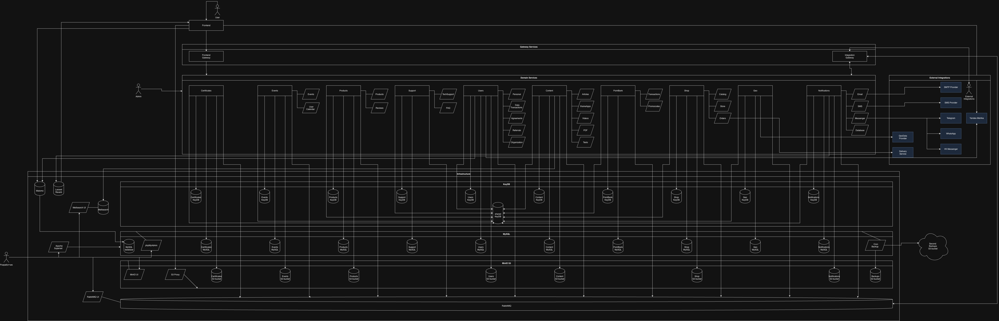

# Обучающая платформа с мотивационной программой

Заказчику нужна была платформа, которая совмещает обучение и мотивационную программу: пользователь проходит контент,
получает за это баллы и обменивает их на реальные награды в магазине платформы.
А также выдерживает лимитированные по времени события - короткие акции, дающие всплеск нагрузки в разы выше обычного дня.

До этого у заказчика была действующая платформа на UMI CMS, которая перестала отвечать требованиям по нагрузке.
Специфика разработки и недоступность исходного кода стали преградами к возможности простого переноса функционала.
Но добавляли задачу по миграции всех пользователей, контента и баллов с их историей.

Бизнес задал три жестких требования: SLA 98%, расчетная емкость под 500 000 MAU и соблюдение 152-ФЗ по персональным данным.
Перед публичным релизом обязательно было прохождение независимого аудита и пентеста.

Как **Lead Backend Developer** отвечал за разработку целиком: проектирование микросервисной архитектуры и ее защита перед бизнесом и командой, 
реализация в установленные сроки, тесты, деплой, метрики и техническая документация.
От ТЗ до релиза в продакшен прошло чуть больше года, одновременно на проекте работали: шесть бэкендеров во главе со мной,
три фронтендера со своим лидом, три менеджера, аналитик, бизнес аналитик, два дизайнера.

Больше про мой опыт лидерства я пишу в [./teamlead.md](https://github.com/vigorexa/vigorexa-cv/blob/main/portfolio/teamlead.md)

Сейчас проект уже больше года в продакшене, я остаюсь его Ведущим Разработчиком с четырьмя разработчиками в команде. 
Работает под 300 000 MAU и успешно провел 5 статусных мероприятий с пиковым RPS более 450. 
За это время обзавелся новыми интеграциями, была переработана система складского учета и зарелижено десятки новых фичей.
Было пережито три крупных инцидента: блокировка Cloudflare, баг из-за состояния гонки в складском учете и регрессионный отказ регистрации после обновления капчи.
По каждому была проведена ретроспектива и написан постмортем.

---

## Цифры

| Показатель                   | Значение                                      |
|------------------------------|-----------------------------------------------|
| Даты разработки              | Март 2024 - Июль 2025                         |
| MAU                          | ~300 000                                      |
| Активированных пользователей | ~500 000; неактивные удаляются                |
| RPS                          | 150+ в обычный день, 450+ при масштабировании |
| Сервисов                     | 12: 2 API Gateway и 10 доменных               |
| Единиц контента              | ~50 000                                       |
| Успешных доставок наград     | ~300 000                                      |
| Объем базы                   | ~40 GB                                        |
| Объем файлов в S3            | ~1 TB                                         |

---

## Архитектура

12 сервисов на Laravel: два API Gateway и десять доменных, из которых восемь дополнительно разделены на модули.
Синхронное взаимодействие по REST, асинхронное - через RabbitMQ.
Real-time - Laravel Reverb, кеш и очереди Horizon - KeyDB, поиск - Meilisearch, файлы - MinIO S3, основная БД - MySQL.
Приложения работают на Swoole под Laravel Octane.

Портал готов и несколько раз проходил процедуру горизонтального масштабирования под ключевые лимитированные события.

Все новые сервисы для этого проекта создаются из форка шаблона про который я рассказываю в [./laravel-sail-template.md](https://github.com/vigorexa/vigorexa-cv/blob/main/portfolio/laravel-sail-template.md)

### Api Gateway

**API Gateway для frontend-приложения.**
Держит первый слой авторизации, проверяет JWT и наполняет запрос заголовками - данными пользователя, ролями и правами. Далее авторизацией занимается доменный сервис.
Собирает ответ из нескольких доменных сервисов параллельно, через корутины Octane вместо последовательных вызовов.

**API Gateway для третьих лиц.** Наполняет запрос ключом сервиса-источника для пропуска стандартного процесса авторизации доменного сервиса.
Собирает ответ также через корутины. Передает и получает события от доменных сервисов в RabbitMQ.
API разрабатывается и документируется для каждой интеграции индивидуально. Общего публичного API нет.
Авторизация проходит через уникальный секретный токен с подписанным протоколом ротации.

### Доменные сервисы

Каждый сервис разворачивается стеком: само приложение на Octane, Horizon для очередей и отдельный cron контейнер.
Набор одинаковый для всех, поэтому новый сервис поднимается по знакомой схеме, а нагрузку разных типов можно масштабировать и разносить независимо.

**Пользователи.** Персональные данные, авторизация и аутентификация.
Система иерархии сотрудников: изменение данных идет через подтверждение вышестоящим по иерархии модератором.
Здесь же реферальная программа, подтвержденные согласия (политика конфиденциальности, рассылки и тд), а также база мест работы (организаций) пользователей.

**Контент.** Пять типов материалов: видео, статьи, PDF, тесты и iframe-приложения, общающиеся с платформой через PostMessage.
Пользователи проходят контент и получают за это баллы. Тут же реализован глобальный поиск Meilisearch

**Банк баллов.** У пользователя несколько кошельков, баллы начисляются за действия на сайте.
Получает событие начисления баллов через RabbitMQ, создает транзакцию и обновляет баланс.
Отдельный слой - промокоды с гибкими условиями: дата, данные пользователя (гео, роли), прохождение контента, покупка товара.

**Магазин.** Обмен баллов на реальные награды: карточки товаров, оформление заказа, складской учет, интеграция со службами доставки.

**Уведомления.** Единая точка доставки с множеством провайдеров: 
запись в базу с доставкой по WebSocket, несколько email-служб с управлением HTML-шаблонами из админки, SMS и мессенджеры - Telegram, VK, WhatsApp.
Запрос о необходимости отправить уведомление с данными получает через RabbitMQ

А также **остальные сервисы:** хранение гео-данных, сертификаты, связь с поддержкой, календарь мероприятий, промо товары с отзывами.

У каждого доменного сервиса своя админ-панель на Filament, и сервисы доступны извне - через Traefik у каждого свой адрес.
Сессия между админками общая, в общей БД KeyDB: достаточно один раз залогиниться в любой из них, чтобы бесшовно переходить в остальные.
Это отдельная поверхность от `/api`: эндпоинты доменных сервисов закрыты секретным токеном в заголовке, который шифруется через `APP_KEY` - без валидного токена запрос до обработчика не доходит.
Gateway и другие сервисы знают этот ключ и прикладывают его к каждому вызову, поэтому заголовки с данными пользователя, которые Gateway наполняет после JWT, принимаются только вместе с прошедшей проверкой токена, а не от любого внешнего запроса.

### База данных MySQL

MySQL - один общий стек на всю платформу, но база у каждого сервиса своя, и у каждого свои учетные данные для подключения.
Логически границы жесткие: сервис не может прочитать чужую базу, потому что его пользователь не имеет к ней доступа.
Чужие данные берутся только через API или события RabbitMQ - запрос через границу сервиса нельзя написать даже случайно.

Сам стек простой: один мастер Percona Server, отдельным сервисом крон-задачи бэкапа, Prometheus-экспортер для метрик и, только на stage, phpMyAdmin.
Экземпляр MySQL пока один: под текущим профилем нагрузки мастер спокойно держит даже пик, поэтому усложнять схему на старте было незачем.

Бэкап снимается раз в день и сразу рассылается в два независимых S3: в изолированный бакет на стороне приложения и в S3 другого дата-центра.

### Тестирование

Проект покрыт тестами, в среднем между сервисами, на 70% под PHPUnit.
Прогоняются автоматически на каждый MergeRequest и при деплое в каждое окружение.
Незакрытыми местами остаются сервисы без сложной логики: Гео хранилище, Поддержка

Написаны e2e тесты на ключевые операции: регистрация, авторизация, создание заказа, прохождение контента.
Запускаются тестером вручную на stage окружении.

Проведено несколько успешных нагрузочных тестов при помощи k6, которые подтвердили двукратный запас по нагрузке в базовой конфигурации.
А также позволили подобрать наиболее эффективный процесс масштабирования под события.

Активно внедряется TDD для новой доменной логики: сначала PHPUnit-тест на правило или сценарий, затем реализация.
Так наращиваем покрытие там, где ошибка дорого стоит, и проще ловить регрессии до деплоя.

### Схема приложения

---

## Основной сценарий: от контента до награды

Главный путь пользователя - пройти материал, получить за это баллы и обменять их на реальную награду.

### Шаг 0. Регистрация и активация

Сначала создается запись пользователя, уходит запрос на модерацию и отправляется уведомление.
До подтверждения аккаунт живет в ограниченном режиме: ни контента, ни баллов, ни магазина.

После подтверждения данных администрацией ставится job chain активации: создание кошельков, начисление приветственных баллов,
проверка и начисление вознаграждения по реферальной программе, снятие ограничений и уведомление пользователю.

### Шаг 1. Прохождение контента

Пользователь открывает материал - видео, статью, PDF, тест или iframe-приложение.

Фронт может присылать промежуточный прогресс - доли просмотра видео, черновик ответов на тесты и тд. 
Необходимо для синхронизации прогресса между устройствами

Отдельно стоят iframe-приложения. Общение идет через PostMessage и состоит из трех сообщений:
1. Приложение сообщает, что полностью загрузилось.
2. Платформа отдает ему сырые данные: пользователя: id, ФИО, аватар, роли и гео; И контента - id, ссылку, содержимое настроек, а также уже записанные прохождения этого пользователя
3. Приложение присылает событие о прохождении: свой внутренний ключ прохождения для соблюдения идемпотентности и количество баллов к начислению.

О завершении сообщает фронт, сервис контента сам проверяет условия прохождения:
что пользователь не утратил право видеть материал по правам и гео или времени жизни контента, что записи о прохождении еще нет и, если применимо, что ответы на тест верные.

При успешном прохождении контента привязанного к сертификату запускается Job проверки.
Если был пройден весь массив, сервис отправит в RabbitMQ события начисления именного .pdf или .gif сертификата в ответственный микросервис.

Также при успешном прохождении контента передается событие необходимости начисления баллов в Банк. Также через RabbitMQ.

### Шаг 2. Начисление баллов

Банк баллов получает событие на создание транзакции начисления с данными о необходимом количестве, пользователе и кошельке для начисления, а также произвольным комментарием и json данными для последующей идентификации.

При создании транзакции блокируется и обновляется баланс соответствующего кошелька. Он нужен для быстрого отображения и периодически сверяется с историей транзакций.

В штатном режиме проходит порядка ~7 тысяч начислений в день. В пик акции - 5-30 событий в секунду

### Шаг 3. Покупка награды за баллы

Пользователь собирает корзину товаров в магазине и оформляет заказ.

Магазин сохраняет модель заказа и ставит job в отдельную очередь Horizon с одним воркером. Шаги внутри job:
1. Повторная проверка наличия товаров на складе и баллов у пользователя - состояние могло измениться с момента оформления.
2. Списание товаров со склада.
3. Синхронное создание транзакции на списание баллов в банке.
4. Создание заказа в службе доставки.
5. Перевод модели заказа в статус успешной обработки.
6. Отправка пользователю уведомления с данными заказа.

Далее пользователь отслеживает заказ через службу доставки или портал и, через время, получает его.

---

## Точки роста

Что вижу следующими шагами и держу в очереди развития:

- **Отделение Horizon очередей.** Вынести асинхронные задачи Horizon на отдельный сервер, чтобы очереди не конкурировали за ресурсы с обработкой запросов - необходимость этого уже видна по метрикам.
- **Реплики MySQL.** Схема репликации, порядок переключения и разведение чтения и записи по приложениям - снимает зависимость от одного экземпляра и дает запас по чтению.
- **Автоматическое масштабирование.** Сейчас реплики сервисов разворачиваются вручную под известные даты акций. Следующий уровень - реакция на метрики, чтобы платформа держала и незапланированный всплеск.
- **E2E в пайплайне.** Сценарии уже написаны, но гоняются вручную на stage; перенос их в CI закроет регрессии на ключевых операциях без участия человека.

---

## Мои личные достижения

**Laravel Octane на всех сервисах.**
Предложил и внедрил Octane под Swoole - первый и пока единственный такой проект в агентстве.
Долгоживущие воркеры вместо bootstrap Laravel на каждый запрос, а на Gateway - корутины для параллельных вызовов доменных сервисов вместо последовательной цепочки REST.
Без Octane микросервисный Gateway на PHP был бы слишком медленным для агрегации ответов.

**Узкое место в однопоточном Redis.**
Нагрузочным тестированием на k6 нашел, что существует bottleneck при логине в однопоточном Redis, который записывает ключи rate limiter.
Перевел кеш на KeyDB и подтвердил стабильные 300 RPS в базовой конфигурации.
KeyDB был выбран, так как использует Redis-совместимый API. Это позволило бесшовно перейти на новый сервис: развертыванием образа и обновлением конфига.

**Файлы в S3 вместо volume.**
Медиа изначально лежали в Docker volume - файлы были привязаны к ноде, реплика сервиса не видела те же данные, деплой рисковал потерей контента.
Перенес хранение в MinIO S3: сейчас там около 1 TB - видео, PDF, аватары, медиа мероприятий, архивы большинства iframe-приложений.
Оригиналы лежат без сжатия, рядом - конверсии в WebP для отдачи в интерфейс. Контейнеры стали stateless, все реплики читают один и тот же бакет.
Миграция прошла бесшовно: файлы переносились фоново; затем на уровне веб сервера был настроен редирект /storage в s3 вместо volume; только после этого backend начал отдавать ссылки до s3 и удалять старые записи о media в БД;

**Переработка процесса оформления заказа.**
На первой акции параллельные заказы на один и тот же товар ушли в гонку - склад ушел в минус.
Решение - строгая очередь обработки заказов с проверкой товаров. Job с сагой заказа падает в очередь, где есть только один исполнитель.
Задачи исполняются последовательно, но даже в пике ожидание не превышает минуты. Это считается приемлемым в проекте.
В саге прописаны компенсации: возврат баллов и товара на склад при исключении во время исполнения. При ошибке отката триггерится алерт.
На случай массовой проблемы предусмотрен Kill Switch: магазин закрывается на обслуживание из админки, новый заказ может создать только аккаунт разработчика.
Более 200 000 успешных доставок прошли через эту схему.

**Новый Workflow разработки.**
Перестроил процессы разработки: кросс код-ревью вместо ревью «сверху вниз», более прозрачный workflow.  
Фичи доходят до интеграции и QA примерно вдвое быстрее чем на других проектах агентства, багфиксы - тоже.
За каждым крупным сервисом закреплен основной разработчик и запасной. Это увеличивает вовлеченность и ответственность за код без потери заменяемости.

**Инфраструктура и CI/CD**
Развернул и настроил облачную инфраструктуру: Docker Swarm, Traefik как точка входа, три окружения - dev, stage и prod.
Защитил database-per-service структуру с отдельными учетными данными. Для того чтобы ограничить возможность чтения чужой БД.
Полностью переработал процесс доставки и деплоя проекта. Написал уникальный процесс CI с проверкой lint, сборкой, автотестами и деплоем образа.
Добавил послойное кеширование образов и перенес базовый образ на Alpine - образ похудел с 1 ГБ до 500 МБ.
В итоге деплой ускорился с 20 до 5 минут.
Добавил процедуру ручного пропуска тестирования при деплое на прод для экстренной заливки хотфиксов. Пригодилась всего дважды, что считаю успехом.

**Наблюдаемость с нуля.**
До меня мониторинг ограничивался проверками доступности в Zabbix.
Добавил трекинг исключений на бэкенде и фронте (Sentry) с трейсом по всем затронутым сервисам, метрики и логи - Grafana, Prometheus, Loki.

Алерты закрывают шесть вещей: слишком долгие ответы, перегрузку железа, исключения в Sentry, всплеск 5xx, неуспешный healthcheck сервиса и недоступность ключевых эндпоинтов - главной, юридических документов, логина.
Маршрут зависит от уровня: обычные уходят на почту и в корпоративный мессенджер, критические дублируются еще и в Telegram.
Что поймали именно алертами: ошибку при оформлении заказов, конкуренцию Horizon за ресурсы общего сервера - так стало видно, что асинхронные задачи пора выносить отдельно, - и блокировку Cloudflare.

---

## Полный стек

- **Backend:** Laravel 11-12, PHP 8.3, Filament 3, Laravel Octane (Swoole)
- **Данные:** MySQL (Percona Server), KeyDB, MinIO S3, Meilisearch
- **Аналитика:** Matomo, Яндекс.Метрика, Apache Superset
- **Обмен данными:** REST, RabbitMQ, Laravel Reverb (WebSocket)
- **Инфраструктура:** Docker Swarm, Traefik, GitLab CI/CD
- **Наблюдаемость:** Zabbix, Grafana, Prometheus, Loki, Sentry
- **Тестирование:** PHPUnit, k6, Postman
